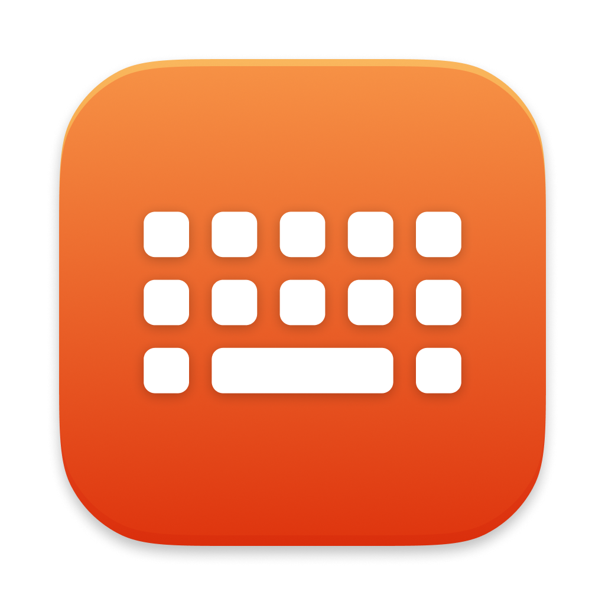
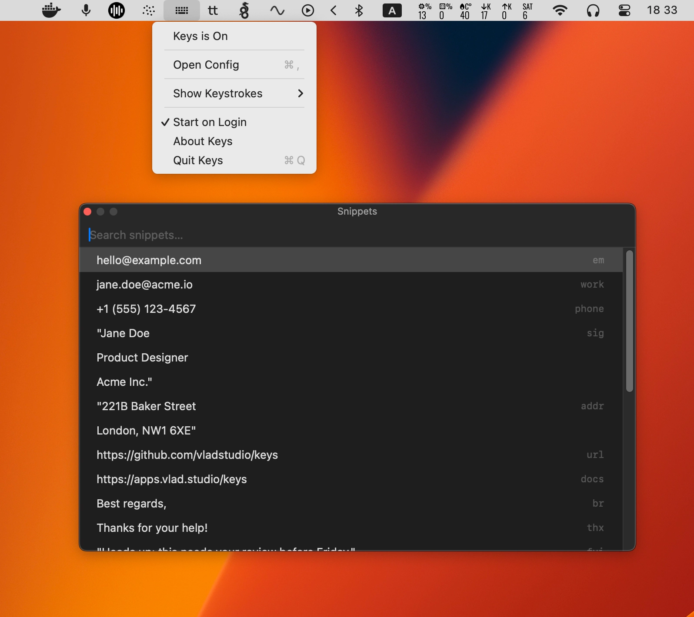

# Keys



A macOS menu bar app that remaps keys and pastes text snippets.



<video src="web/show-keystrokes.mp4" width="800" autoplay loop muted playsinline></video>

- **Key remapping** — single keys, modifier combos, double-tap sequences
- **Input source toggle** — cycle keyboard languages with a single key (e.g. caps lock)
- **Snippet picker** — trigger a floating picker with a keystroke, filter and paste
- **Keystroke overlay** — show pressed keys on screen (great for screencasts and demos)
- **Plain text config** — edit `~/.config/keys/keys.conf`, changes apply automatically

## Requirements

- macOS 15 (Sequoia) or later

## Install

```sh
/bin/bash -c "$(curl -fsSL https://raw.githubusercontent.com/vladstudio/keys/main/install.sh)"
```

On first launch, grant Accessibility and Input Monitoring access in System Settings.

## Configuration

Edit `~/.config/keys/keys.conf`:

```
[remap]
caps_lock: toggle_input
option+shift+a: control+b
control, control: snippets

[snippet]
Hello world
em: my.email@example.com
"Best regards,
Steve"
```

### Remaps

One rule per line: `input: output`. Combine modifiers with `+`: `option+shift+a`. Sequences use `, `: `control, control: snippets`.

**Per-keyboard remaps**: Use `[remap:internal]` for the built-in MacBook keyboard or `[remap:external]` for USB/Bluetooth keyboards. Plain `[remap]` applies to all keyboards. You can use multiple remap sections:

```
[remap]
control, control: snippets

[remap:internal]
caps_lock: toggle_input

[remap:external]
caps_lock: escape
```

Special outputs:
- `snippets` — open the snippet picker
- `toggle_input` — cycle through enabled keyboard input sources (e.g. English → Russian → English)
- `open(AppName)` — launch an app (e.g. `f5: open(Safari)`)
- `bash(command)` — run a shell command (e.g. `f6: bash(say hello)`)
- `paste(text)` — paste text directly (e.g. `f7: paste(Hello!)`)
- `ignore` — disable the key completely (e.g. `caps_lock: ignore`)

Caps lock remaps to real keys (e.g. `caps_lock: f20`) use `hidutil` for HID-level remapping. All other remaps use CGEventTap. When using caps lock remaps, set Caps Lock to "No Action" in System Settings > Keyboard > Modifier Keys to avoid conflicts.

### Snippets

One snippet per line — the text that will be pasted. For multi-line snippets or text containing `:`, wrap in double quotes. Use `""` to escape a literal `"`.

Add an optional keyword before the text: `em: my.email@example.com`. Typing the keyword exactly in the picker puts that snippet at the top.

When the snippet picker opens, type to filter, use arrow keys to navigate, Enter to paste, Escape to close. Search is fuzzy — it prioritizes matches at word boundaries (e.g. `jd` finds `john@doe.com`) and prefers matches closer to the start of a snippet.

### Key names

`a`–`z`, `0`–`9`, `f1`–`f20`, `return` (or `enter`), `tab`, `space`, `delete`, `escape`, `caps_lock`, `forward_delete`, `up`, `down`, `left`, `right`, `minus`, `equal`, `left_bracket`, `right_bracket`, `backslash`, `semicolon`, `quote`, `grave`, `comma`, `period`, `slash`, `shift`, `control`, `option`, `command` (and `right_*` variants).

**Media keys** (input only): `brightness_up`, `brightness_down`, `volume_up`, `volume_down`, `mute`, `play`, `next`, `previous`, `illumination_up`, `illumination_down`.

---

License: MIT
